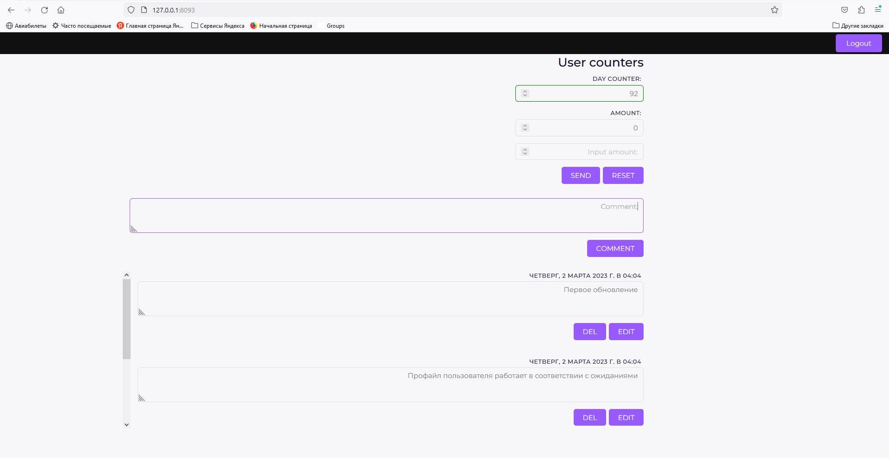

Шаблон профайла пользователя с параметрами:

    `amount` - некоторый параметр, который аутентифицированный пользователь может менять вручную
    `day_counter` - счётчик количества дней с момента начала регистрации до нормативного значения (92)

Поле `amount` можно изменять, инкрементацией/декрементацией на 1 или из поля `Input amount`, подтверждая ввод
нажатием на кнопку `SEND`.

Для этого примера представлена реализация конечных точек и моделей данных в папке backend/modules.
В папке frontend/rtl находится html шаблон с js-файлами.

